---
## Front matter
lang: ru-RU
title: Лабораторная работа №2
subtitle: Операционные системы
author:
  - Чувакина М. В.
institute:
  - Российский университет дружбы народов, Москва, Россия
date: 22 февраля 2024 

## i18n babel
babel-lang: russian
babel-otherlangs: english

## Formatting pdf
toc: false
toc-title: Содержание
slide_level: 2
aspectratio: 169
section-titles: true
theme: metropolis
header-includes:
 - \metroset{progressbar=frametitle,sectionpage=progressbar,numbering=fraction}
 - '\makeatletter'
 - '\beamer@ignorenonframefalse'
 - '\makeatother'
---

## Цель работы

Цель данной лабораторной работы -- изучение идеологии и применение средств контроля, освоение умения по работе с git.

## Задание

1. Создать базовую конфигурацию для работы с git.
2. Создать ключ SSH.
3. Создать ключ PGP.
4. Настроить подписи git.
5. Зарегистрироваться на Github.
6. Создать локальный каталог для выполнения заданий по предмету.

## Выполнение лабораторной работы. Базовая настройка git.

Задаю в качестве имени и email владельца репозитория свои имя, фамилию и электронную почту (рис.1). 

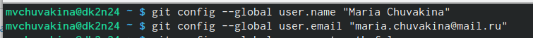{#fig:001 width=70%}

## Выполнение лабораторной работы. Базовая настройка git.

Настраиваю utf-8 в выводе сообщений git для их корректного изображения (рис.2).

{#fig:002 width=70%}

## Выполнение лабораторной работы. Базовая настройка git.

Начальной ветке задаю имя master (рис.3).

{#fig:003 width=70%}

## Выполнение лабораторной работы. Базовая настройка git.

Задаю параметры autocrlf и safecrlf (рис.4).

{#fig:004 width=70%}

## Выполнение лабораторной работы. Создание ключа SSH.

Создаю ключ ssh размером 4096 бит по алгоритму rsa (рис.5).

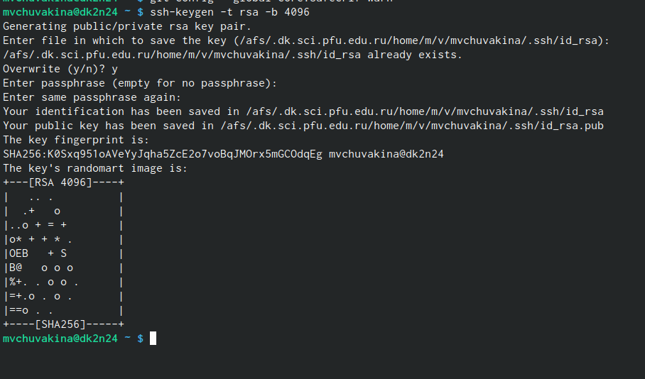{#fig:005 width=70%}

## Выполнение лабораторной работы. Создание ключа SSH.

Создаю ключ ssh по алгоритму ed25519 (рис.6).

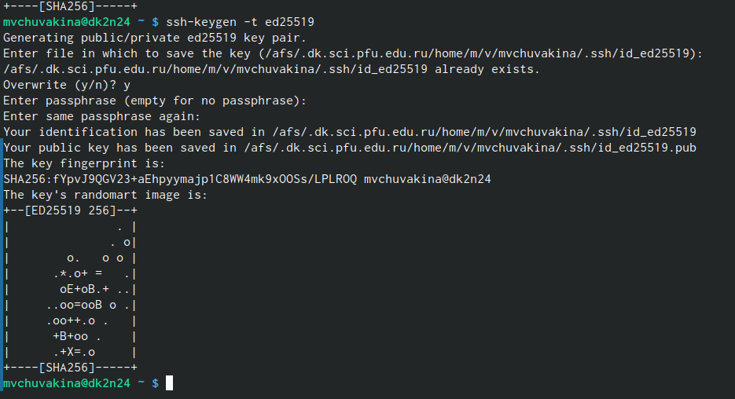{#fig:006 width=70%}

## Выполнение лабораторной работы. Создание ключа GPG.

Генерирую ключ GPG, затем выбираю тип ключа RSA and RSA, задаю максимальную длину ключа:
4096, оставляю неограниченный срок действия ключа. Далее отвечаю на вопросы программы о личной информации.
(рис.7).

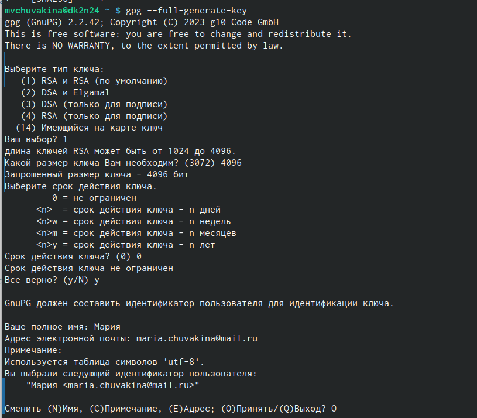{#fig:007 width=70%}

## Выполнение лабораторной работы. Создание ключа GPG.

Ввожу фразу-пароль для защиты нового ключа (рис.8).

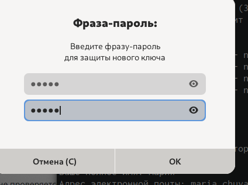{#fig:008 width=70%}

## Выполнение лабораторной работы. Регистрация на Github.

У меня уже был создан аккаунт на Github, соответсвенно, основные данные аккаунта я так же заполняла и проводила его настройку,  поэтому просто вхожу в свой аккаунт.

## Выполнение лабораторной работы. Добавление ключа GPG в Github.

- Вывожу список созданных ключей в терминал
- Ищу в результате запроса отпечаток ключа
- Копирую его в буфер обмена. (рис.9).

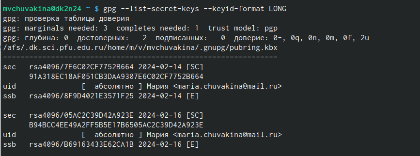{#fig:009 width=70%}

## Выполнение лабораторной работы. Добавление ключа GPG в Github.

Ввожу в терминале команду, c помощью которой копирую сам ключ GPG в буфер обмена (рис.10).

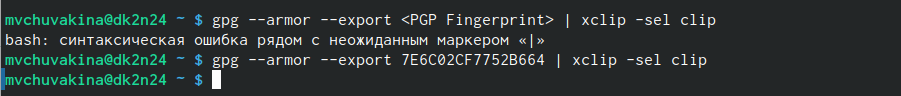{#fig:010 width=70%}

## Выполнение лабораторной работы. Добавление ключа GPG в Github.

- Открываю настройки Github 
- Ищу среди них добавление GPG ключа (рис.11).

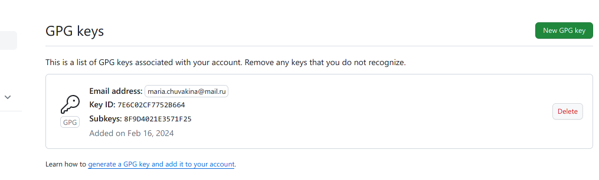{#fig:011 width=70%}

## Выполнение лабораторной работы. Добавление ключа GPG в Github.

Нажимаю на "New GPG key" и вставляю в поле ключ из буфера обмена (рис.12).

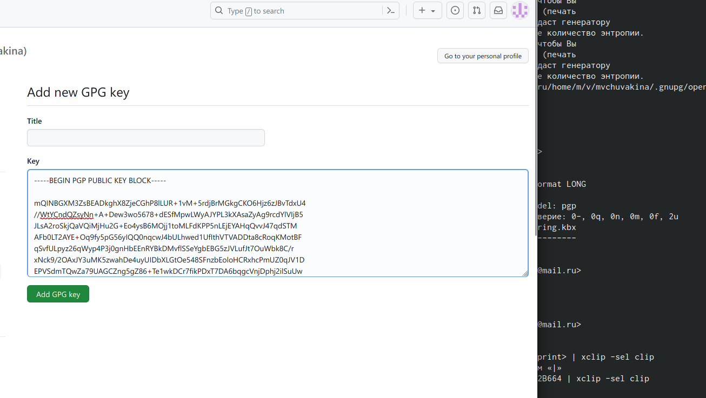{#fig:012 width=70%}

Я добавила ключ GPG на Github.

## Выполнение лабораторной работы. Настройка подписи Git.

Настраиваю автоматические подписи коммитов git: используя введенный ранее email, указываю git, использую его при создании подписей коммитов.(рис.13). 

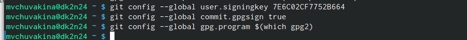{#fig:013 width=70%}

## Выполнение лабораторной работы. Настройка gh.

- Начинаю авторизацию в gh, 
- Отвечаю на наводящие вопросы от утилиты
- Выбираю авторизоваться через браузер (рис.14).

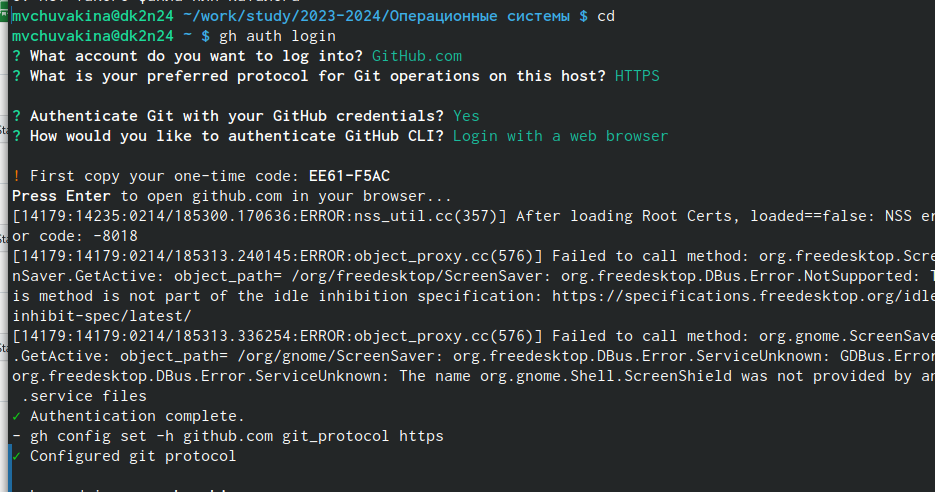{#fig:014 width=70%}

## Выполнение лабораторной работы. Создание репозитория курса на основе шаблона.

- Создаю директорию с помощью утилиты mkdir 
- Перехожу в созданную директорию 
- Клонирую репозиторий к себе в директорию (рис.15).

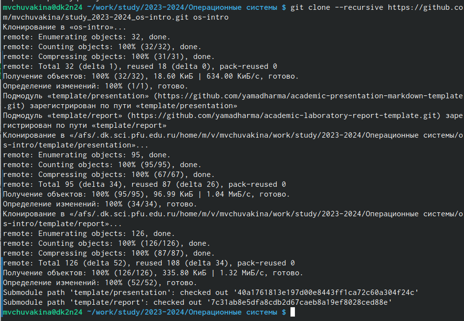{#fig:015 width=70%}

## Выполнение лабораторной работы. Создание репозитория курса на основе шаблона.

- Перехожу в каталог курса
- Проверяю содержание каталога (рис.16).

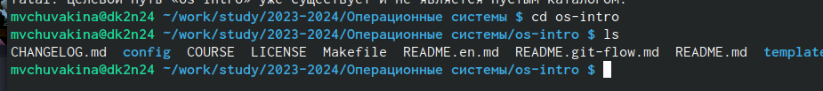{#fig:016 width=70%}

## Выполнение лабораторной работы. Создание репозитория курса на основе шаблона.

- Удаляю лишние файлы 
- Создаю необходимые каталоги, используя makefile (рис.17).

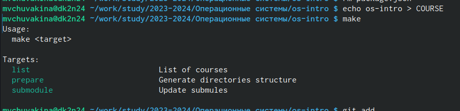{#fig:017 width=70%}

## Выполнение лабораторной работы. Создание репозитория курса на основе шаблона.

- Добавляю все новые файлы для отправки на сервер 
- Комментирую из с помощью git commit
- Отправляю файлы на сервер с помощью git push (рис.18).

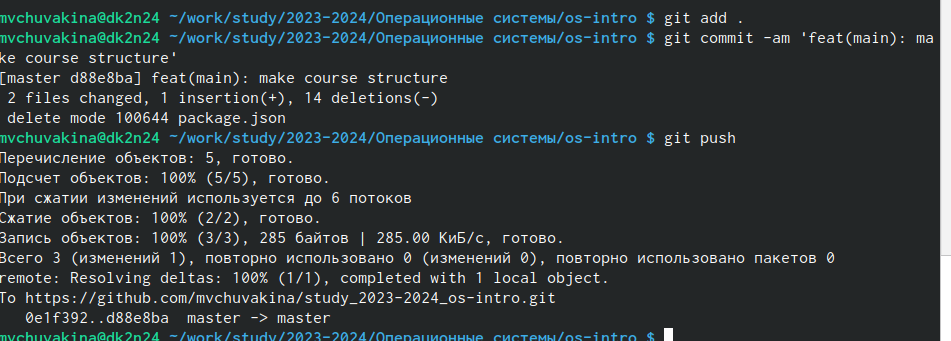{#fig:018 width=70%}

## Выводы

При выполнении данной лабораторной работы я изучила идеологию и применение средств контроля версий, освоила умение по работе с git.

