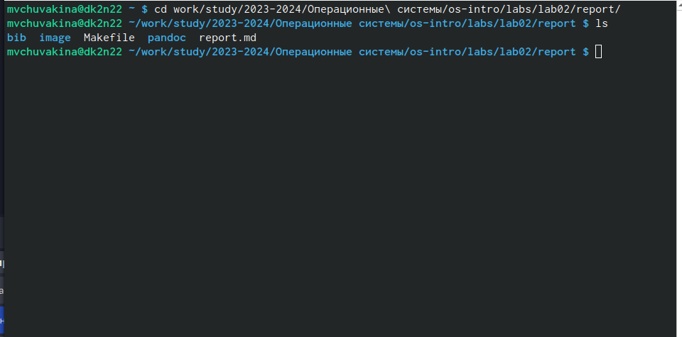
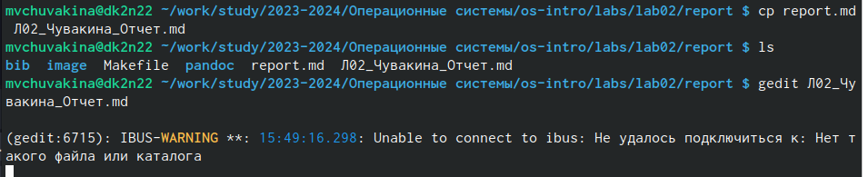
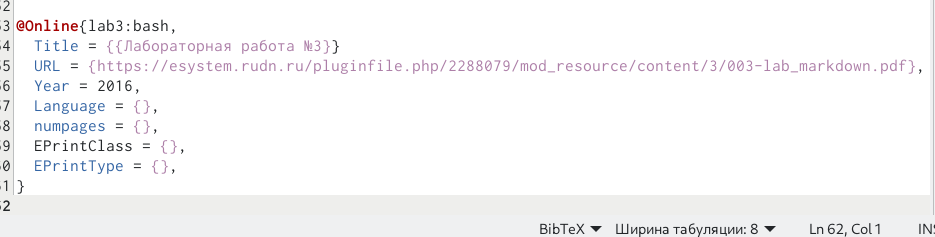
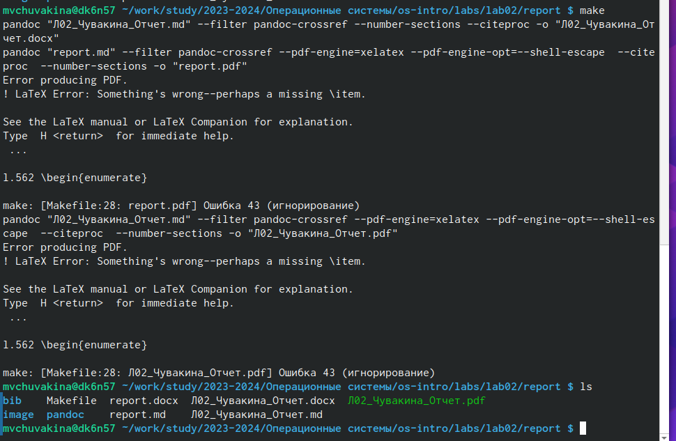
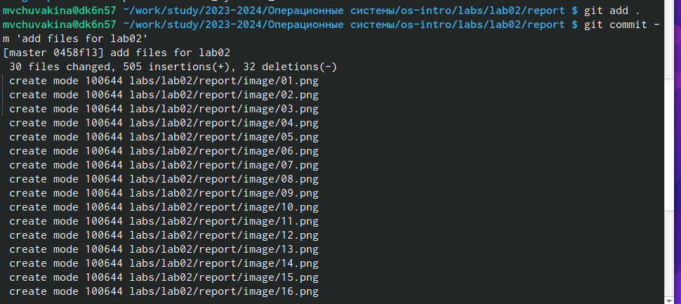
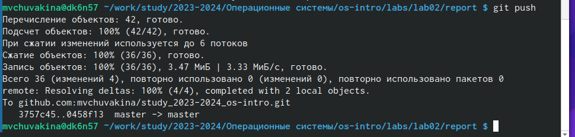

---
## Front matter
lang: ru-RU
title: Презентация по лабораторной работе № 3
subtitle: Операционные системы
author:
  - Чувакина М. В.
institute:
  - Российский университет дружбы народов, Москва, Россия
date: 22 февраля 2024

## i18n babel
babel-lang: russian
babel-otherlangs: english

## Formatting pdf
toc: false
toc-title: Содержание
slide_level: 2
aspectratio: 169
section-titles: true
theme: metropolis
header-includes:
 - \metroset{progressbar=frametitle,sectionpage=progressbar,numbering=fraction}
 - '\makeatletter'
 - '\beamer@ignorenonframefalse'
 - '\makeatother'
---

:::
::::::::::::::

## Цели и задачи

- Научиться оформлять отчёты с помощью легковесного языка разметки Markdown.
- Сделать отчёт по предыдущей лабораторной работе в формате Markdown.

## Теоретическое введение

Markdown — облегчённый язык разметки, созданный с целью обозначения форматирования в простом тексте, с максимальным сохранением его читаемости человеком, и пригодный для машинного преобразования в языки для продвинутых публикаций. 

## Выполнение лабораторной работы

Перехожу в каталог, в котором находится шаблон для отчета по лабораторной работе (рис.1).

{#fig:001 width=70%}

## Выполнение лабораторной работы

Создаю копию шаблона, в которой буду работать (рис.2).

{#fig:002 width=70%}

## Выполнение лабораторной работы

Открываю созданный файл с помощью текстового редактора gedit (рис.3).

{#fig:003 width=70%}

## Выполнение лабораторной работы

- Работала над списком библиографии, 
- Вставка ссылок в текст отчета (рис. 4).

{#fig:004 width=70%}

## Выполнение лабораторной работы

- Выполнила его компиляцию из формата md в форматы docx и pdf (рис.5).

{#fig:005 width=70%}

## Выполнение лабораторной работы

Далее отправила созданные и скомпилированные файлы на глобальный репозиторий (рис.6).

{#fig:006 width=70%}

## Выполнение лабораторной работы

Последнее действие в отправке с помощью команды git push (рис.7).

{#fig:007 width=70%}

## Выводы

При выполнении данной лабораторной работы я научилась оформлять отчеты с помощью легковесного языка разметки Markdown.

# Спасибо за внимание

