---
## Front matter
lang: ru-RU
title: Презентация по лабораторной работе №7
subtitle: Операционные системы
author:
  - Чувакина М. В.
institute:
  - Российский университет дружбы народов, Москва, Россия
date: 20 марта 2024

## i18n babel
babel-lang: russian
babel-otherlangs: english

## Formatting pdf
toc: false
toc-title: Содержание
slide_level: 2
aspectratio: 169
section-titles: true
theme: metropolis
header-includes:
 - \metroset{progressbar=frametitle,sectionpage=progressbar,numbering=fraction}
 - '\makeatletter'
 - '\beamer@ignorenonframefalse'
 - '\makeatother'
---

# Информация

## Докладчик

:::::::::::::: {.columns align=center}
::: {.column width="70%"}

  * Чувакина Мария Владимировна
  * студентка из группы НКАбд-06-23
  * факультет физико-математических и естественных наук
  * Российский университет дружбы народов
  * [1132236055@rudn.ru](mailto:1132236055@rudn.ru)
  * <https://mvchuvakina.github.io/ru/>

:::
::: {.column width="30%"}

:::
::::::::::::::

## Цель работы

Целью данной лабораторной работы является ознакомление с файловой системой Linux, её структурой, именами и содержанием каталогов. Приобретение практических навыков по применению команд для работы
с файлами и каталогами, по управлению процессами (и работами), по проверке использования диска и обслуживанию файловой системы.

## Задание

1. Выполнить все примеры из лабораторной работы
2. Выполнить команды по копированию, созданию и перемещению файлов и каталогов
3. Определить опции команды chmod
4. Изменить права доступа к файлам
5. Прочитать документацию о командах mount, fsck, mkfs, kill

# Выполнение лабораторной работы

## Выполнение примеров

Создаю файл, дважды копирую его с новыми именами и проверяю, что все команды были выполнены корректно.

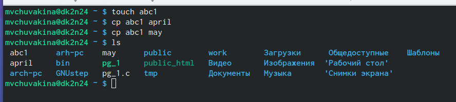

## Выполнение примеров

Создаю директорию, копирую в нее два файла, созданных на прошлом этапе, проверяю, что все скопировалось.

## Выполнение примеров

Копирую файл, находящийся не в текущей директории в файл с новым именем тоже не в текущей директории.

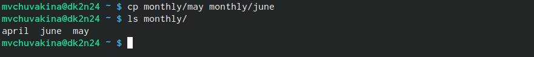

## Выполнение примеров

Создаю новую директорию. Копирую предыдущую созданную директорию вместе со всем содержимым  в каталог /tmp. Затем копирую предыдущую созданную директорию в новую созданную.

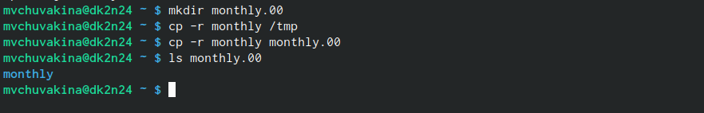

## Выполнение примеров

Переименовываю файл, затем перемещаю его в каталог.

## Выполнение примеров

Создаю новую директорию, переименовываю monthly.00 в monthly.01, перемещаю директорию в директорию reports, переименовываю эту директорию, убираю из названия 01.

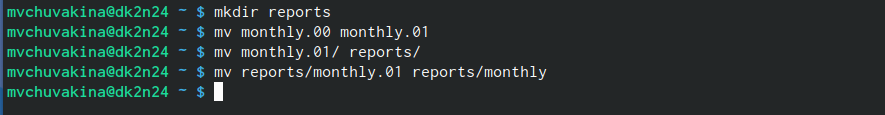

## Выполнение примеров

Создаю пустой файл, проверяю права доступа у него, изменяю права доступа, добавляя пользователю(создателю) можно выполнять файл.

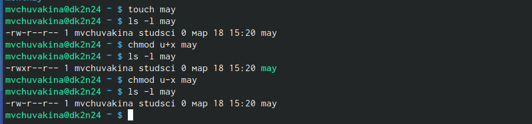

## Выполнение примеров

Меняю права доступа у директории: группы и остальные пользователи не смогут ее прочесть.

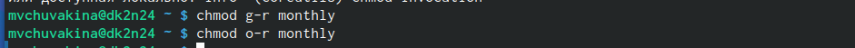

## Выполнение примеров

Изменяю права доступа у директории, запрещаю группам и остальным пользователям читать. Создаю новый пустой файл, даю ему права доступа: группы могут в этом чате писать содержимое.

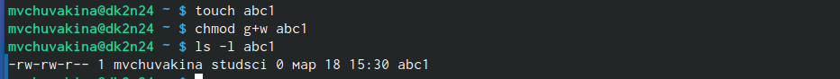

## Выполнение примеров

Проверяю файловую систему.

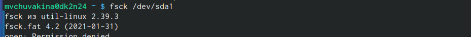

## Выполнение команд по копированию, созданию и перемещению файлов и каталогов

Копирую файл в домашний каталог с новым именем, создаю новую пустую директорию, перемещаю файл в эту директорию, переименовываю файл.

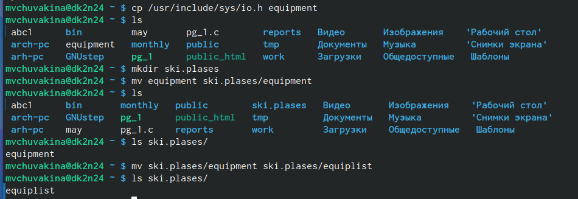

## Выполнение команд по копированию, созданию и перемещению файлов и каталогов

Создаю новый файл, копирую его в новую директорию, но уже сразу с новым именем. Создаю внутри этого каталога подкаталог, перемещаю файлы в подкаталог.

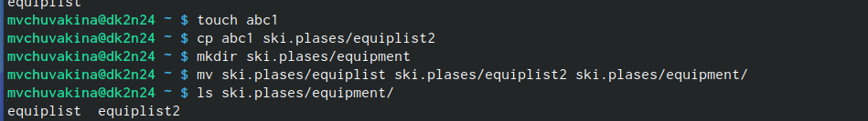

## Выполнение команд по копированию, созданию и перемещению файлов и каталогов

Создаю новую директорию, в этой же строчке перемещаю ее с новым именем в директорию, созданную в прошлый раз.

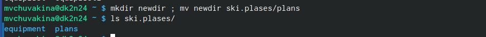

## Определить опции команды chmod

Проверяю, какие права нужно поменять и как, чтобы у новой директории были нужные по заданию права.

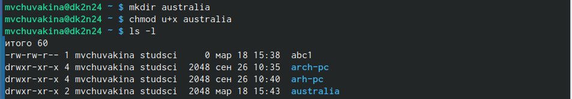

## Определить опции команды chmod

Проверяю, какие права нужно поменять и как, чтобы у новой директории были нужные по заданию права.
 
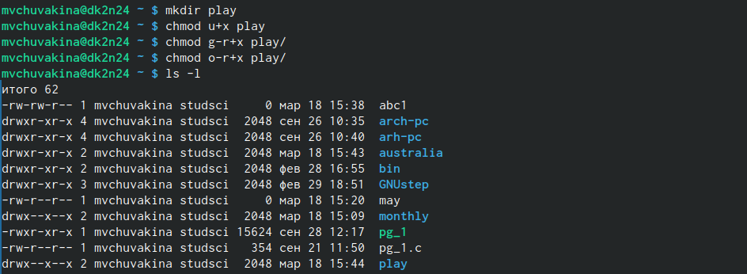

## Определить опции команды chmod

Создаю файл, добавляю в правах доступа право на исполнение и убираю право на запись для владельца, затем создаю следующий файл, ему в правах доступа добавляю право на запись для группы (рис.16).

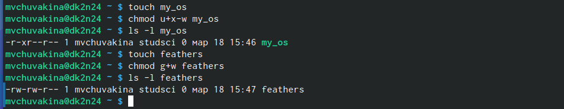

## Чтение файла

Читаю содержимое файла.

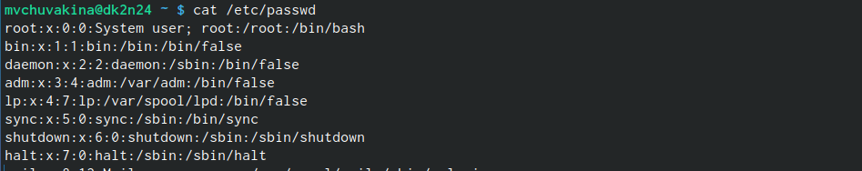

## Выполнение команд по копированию, созданию и перемещению файлов и каталогов

Копирую файл с новым именем, перемещаю его в ранее созданную директорию, рекурсивно ее копирую с новым именем, рекурсивно копирую в нее скопированную до этого папку.

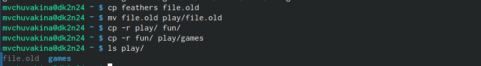

## Изменение прав доступа к файлам

Убираю право на чтение файла у создателя, поэтому не могу его прочесть, также не могу скопировать, потому что отказано в доступе на чтение, возвращаю все права.

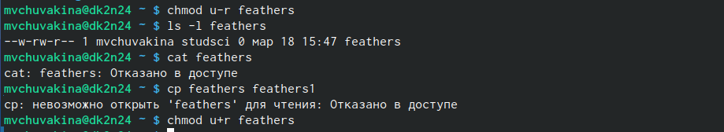

## Изменение прав доступа к файлам

Убираю у директории право на исполнение для пользователя, затем возвращаю все права.

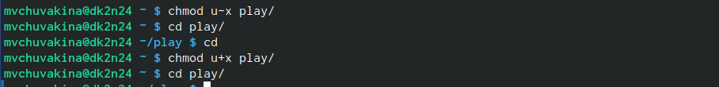

## Чтение документации о командах mount, fsck, mkfs, kill

- mount — утилита командной строки в UNIX-подобных операционных системах. Применяется для монтирования файловых систем.
- fsck (проверка файловой системы) - это утилита командной строки, которая позволяет выполнять проверки согласованности и интерактивное исправление в одной или нескольких файловых системах Linux.

## Чтение документации о командах mount, fsck, mkfs, kill

- mkfs используется для создания файловой системы Linux на некотором устройстве, обычно в разделе жёсткого диска. В качестве аргумента filesys для файловой системы может выступать или название устройства
- Команда Kill посылает указанный сигнал указанному процессу. Если не указано ни одного сигнала, посылается сигнал SIGTERM. Сигнал SIGTERM завершает лишь те процессы, которые не обрабатывают его приход. Для других процессов может быть необходимым послать сигнал SIGKILL, поскольку этот сигнал перехватить невозможно.

## Выводы

При выполнении данной лабораторной работы я ознакомилась с файловой системой Linux, её структурой, именами и содержанием каталогов, приобрела практические навыки по применению команд для работы
с файлами и каталогами, по управлению процессами (и работами), по проверке использования диска и обслуживанию файловой системы.
