---
## Front matter
lang: ru-RU
title: Лабораторная работа №7
subtitle: Операционные системы
author:
  - Чувакина М. В.
institute:
  - Российский университет дружбы народов, Москва, Россия
date: 01 апреля 2024

## i18n babel
babel-lang: russian
babel-otherlangs: english

## Formatting pdf
toc: false
toc-title: Содержание
slide_level: 2
aspectratio: 169
section-titles: true
theme: metropolis
header-includes:
 - \metroset{progressbar=frametitle,sectionpage=progressbar,numbering=fraction}
 - '\makeatletter'
 - '\beamer@ignorenonframefalse'
 - '\makeatother'
---

# Информация

## Докладчик

:::::::::::::: {.columns align=center}
::: {.column width="70%"}

  * Чувакина Мария Владимировна
  * студентка из группы НКАбд-06-23
  * факультет физико-математических и естественных наук
  * Российский университет дружбы народов
  * [1132236055@rudn.ru](mailto:1132236055@rudn.ru)
  * <https://mvchuvakina.github.io/ru/>

:::
::: {.column width="30%"}

:::
::::::::::::::

## Цель работы

Цель данной лабораторной работы - освоение основных возможностей командной оболочки Midnight Commander, приобретение навыков практической работы по просмотру каталогов и файлов; манипуляций с ними

## Выполнение лабораторной работы

С помощью команды man mc прочитала документацию про командную оболочку.
 
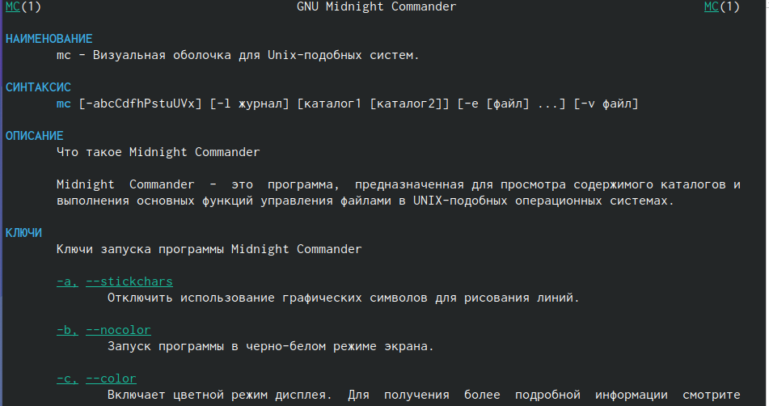{#fig:001 width=70%}

## Выполнение лабораторной работы

Ввожу в терминале mc и получаю окно, в котором далее смогу работать.
 
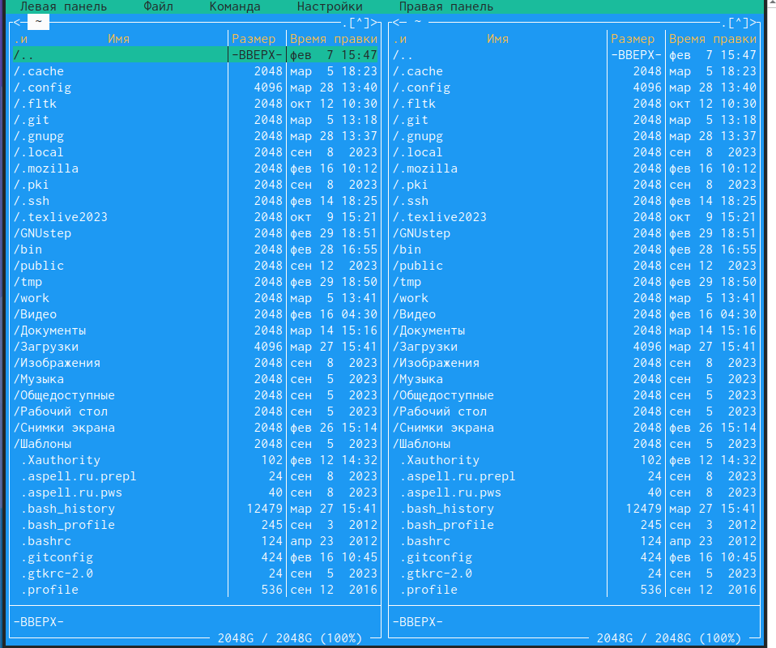{#fig:002 width=70%}

## Выполнение лабораторной работы

С помощью стрелочек влево вправо я могу перемещаться по директориям, а с помощью стрелочек вверх вниз перебирать файлы в директории, в которой нахожусь.
 
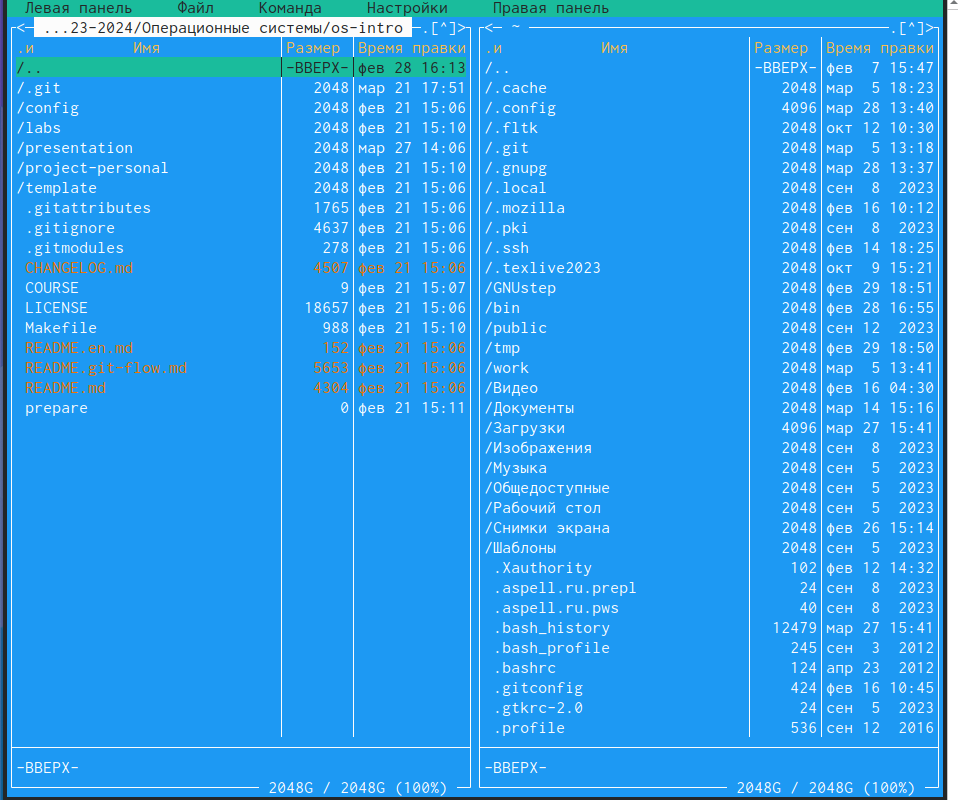{#fig:003 width=70%}

## Выполнение лабораторной работы

С помощью F5 могу создать копию файла в выбранном каталоге.
 
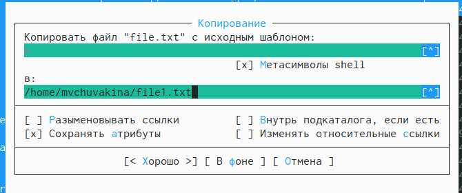{#fig:004 width=70%}

## Выполнение лабораторной работы

С помощью управляющих клавиш так же можно получить информациб о правах доступа на файл и информацию о нем.
 
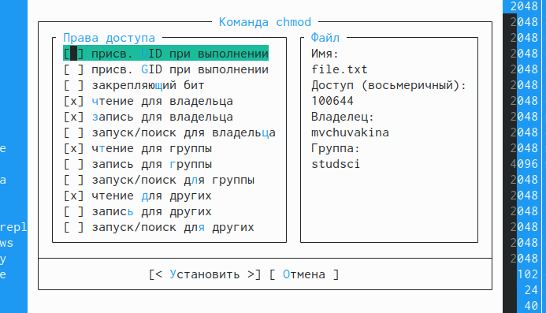{#fig:005 width=70%}

## Выполнение лабораторной работы

В меню правой панели вывела информацию о файле, получаю информации больше чем в выводе ls -l.
 
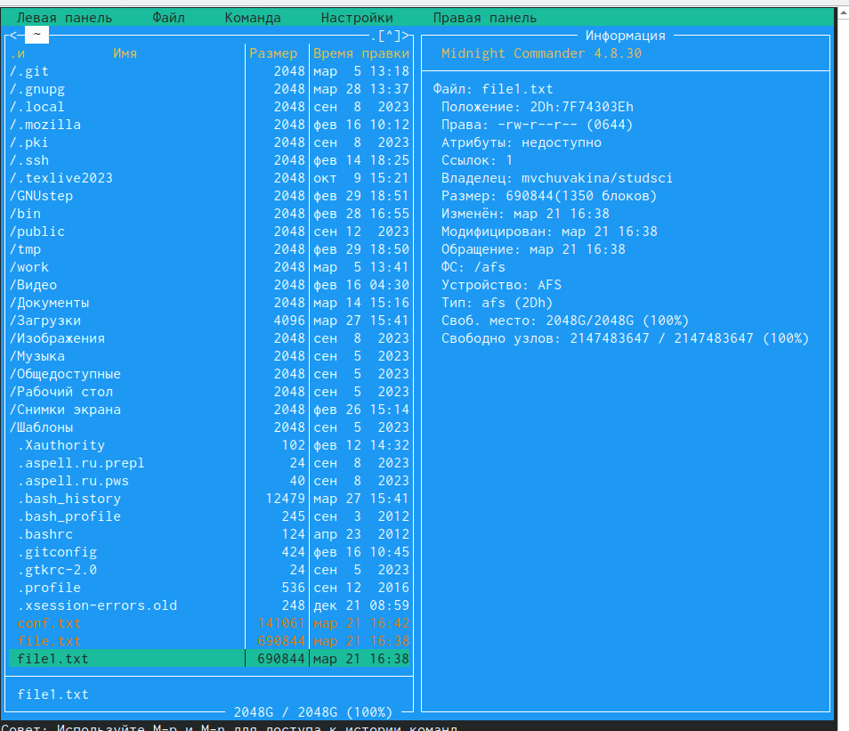{#fig:006 width=70%}

## Выполнение лабораторной работы

Используя возможности подменю "Файл" я просмотрела содержимое текстового файла.
 
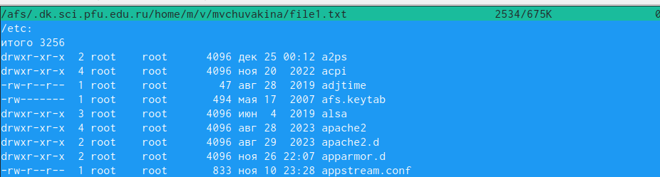{#fig:007 width=70%}

## Выполнение лабораторной работы

Открыла файл на изменение, поменяла пару строк и закрыла файл без сохранения.
 
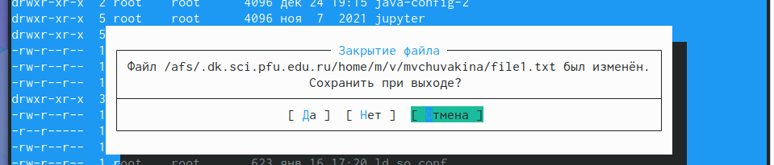{#fig:008 width=70%}

## Выполнение лабораторной работы

Создала новый каталог.
 
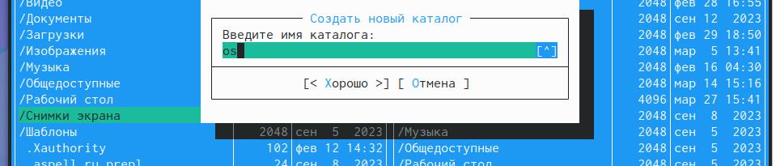{#fig:009 width=70%}

## Выполнение лабораторной работы

Копирую файл в созданный каталог. Действия выше можно было сделать с помощью горячих клавиш.
 
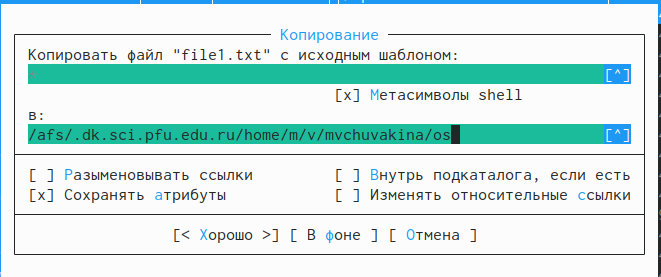{#fig:010 width=70%}

## Выполнение лабораторной работы

С помощью средств подменю Команда можно найти файл с заданным условием, я искала файлы формата .txt.
 
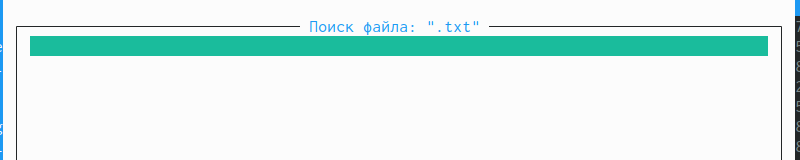{#fig:011 width=70%}

## Выполнение лабораторной работы

Можно перемещаться между директориями, я перемещусь в домашнюю.
 
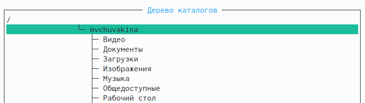{#fig:012 width=70%}

## Выполнение лабораторной работы

Можно использовать историю команд и применить команду из истории, я применила копирование файла.
 
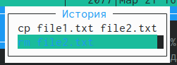{#fig:013 width=70%}

## Выполнение лабораторной работы

Анализирую файл расширения.
 
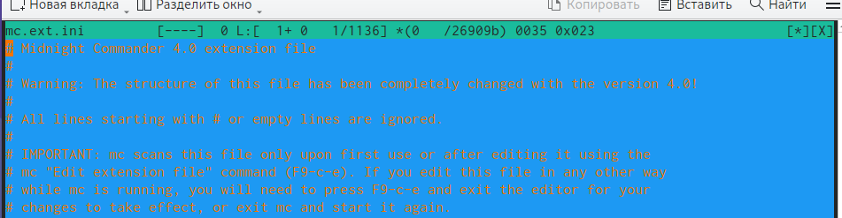{#fig:014 width=70%}

## Выполнение лабораторной работы

Анализирую файл меню.
 
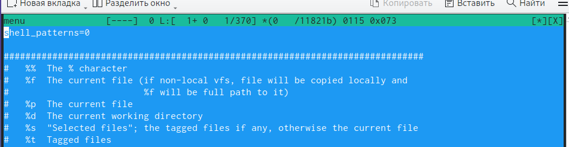{#fig:015 width=70%}

## Выполнение лабораторной работы

Из подменю настройки вызвала окна настройки панели, настройки внешнего вида, настройки распознавания клавиш, параметры конфигурации.

## Выполнение лабораторной работы

Командой touch text.txt создала файл.
 
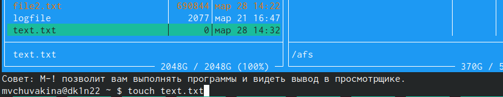{#fig:020 width=70%}

## Выполнение лабораторной работы

Клавишей F4 открыла файл для записи, добавила в него текст.
 
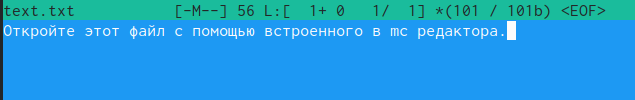{#fig:021 width=70%}

## Выполнение лабораторной работы
 
Выделяю текст с помощью клавиши F3 и кликов мышью.
 
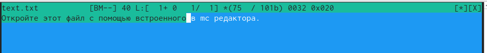{#fig:022 width=70%}

## Выполнение лабораторной работы
 
Перемещаю выделенный текст с помощью клавиши F6.
 
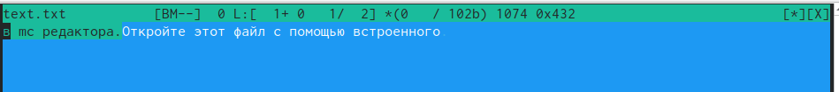{#fig:023 width=70%}

## Выполнение лабораторной работы
 
Удалила строку текста с помощью ctrl+y.
 
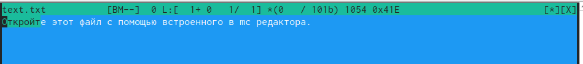{#fig:024 width=70%}

## Выполнение лабораторной работы
 
Сохраняю изменения в файле с помощью горячей клавиши F2.
 
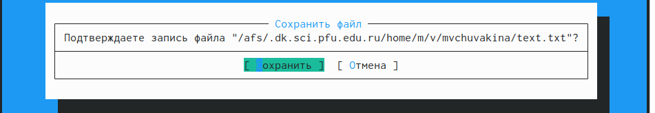{#fig:025 width=70%}

## Выполнение лабораторной работы

С помощью ctrl+u отменяю поседнее действие и возвращаю удаленную строку.
 
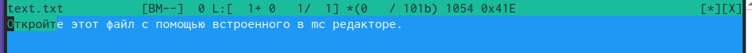{#fig:026 width=70%}

## Выполнение лабораторной работы
 
С помощью клавиш pgup pgdn у меня получилось попасть в начало и в конец файла соответственно, я добавила текст в начало и в конец файла.
 
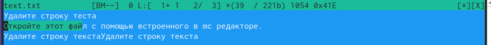{#fig:027 width=70%}

## Выполнение лабораторной работы
 
Горячая клавиша F10 закрывает файл, дополнительно спрашивая сохранить ли в нем несохраненные изменения, сохраняю и закрываю.
 
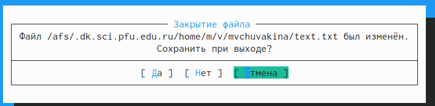{#fig:028 width=70%}

## Выполнение лабораторной работы
 
Открываю файл формата .cpp, с кодом на С++, встроенный редактор mc вывел его содержимое с подсветкой.
 
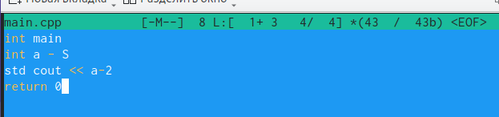{#fig:029 width=70%}

## Выполнение лабораторной работы
 
Я отключила подсветку и вывела снова тот же самый файл, но уже без подсветки.
 
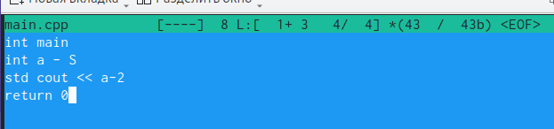{#fig:030 width=70%}
 
# Выводы

При выполнениии данной лабораторной работы я освоила основные возможности командной оболочки Midnight Commander, приобрела навыки практической работы по просмотру каталогов и файлов; манипуляций с ними.
 
