---
## Front matter
lang: ru-RU
title: Лабораторная работа №10
subtitle: Операционные системы
author:
  - Чувакина М. В.
institute:
  - Российский университет дружбы народов, Москва, Россия
date: 04 апреля 2024

## i18n babel
babel-lang: russian
babel-otherlangs: english

## Formatting pdf
toc: false
toc-title: Содержание
slide_level: 2
aspectratio: 169
section-titles: true
theme: metropolis
header-includes:
 - \metroset{progressbar=frametitle,sectionpage=progressbar,numbering=fraction}
 - '\makeatletter'
 - '\beamer@ignorenonframefalse'
 - '\makeatother'
---

# Информация

## Докладчик

:::::::::::::: {.columns align=center}
::: {.column width="70%"}

  * Чувакина Мария Владимировна
  * студентка из группы НКАбд-06-23
  * факультет физико-математических и естественных наук
  * Российский университет дружбы народов
  * [1132236055@rudn.ru](mailto:1132236055@rudn.ru)
  * <https://mvchuvakina.github.io/ru/>

:::
::: {.column width="30%"}

:::
::::::::::::::

## Цель работы

Цель данной лабораторной работы - познакомиться с операционной системой Linux, получить практические навыки работы с редактором vi, установленным по умолчанию практически во всех дистрибутивах.

## Задание

1. Ознакомиться с теоретическим материалом.
2. Ознакомиться с редактором vi.
3. Выполнить упражнения, используя команды vi.

## Выполнение лабораторной работы

Создаю директорию, в которой буду работать, с помощью команды mkdir, перехожу в нее с помощью команды cd, создаю и открываю для редактирования файл с помощью встроенного текстового редактора vi.

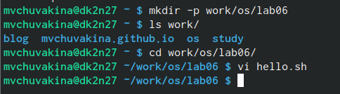{#fig:001 width=70%}

## Выполнение лабораторной работы

Нажимаю i, чтобы начать редактирование и добавляться текст (режим добавления), далее добавляю текст.

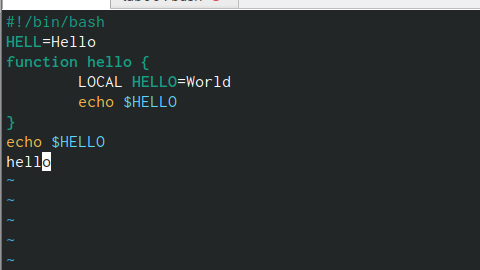{#fig:002 width=70%}

## Выполнение лабораторной работы

Нажимаю esc, чтобы выйти из режима добавления и перейти в командный режим. Перехожу в режим последней строки.

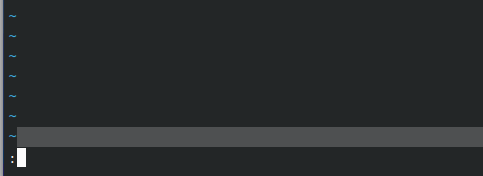{#fig:003 width=70%}

## Выполнение лабораторной работы

Ввожу w для сохранения и q для выхода и нажимаю enter, после чего файл сохраняется с изменениями и я возвращаюсь в терминал.

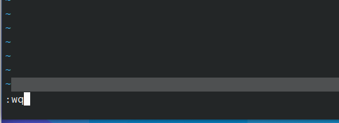{#fig:004 width=70%}

## Выполнение лабораторной работы

С помощью chmod добавляю права на исполнение файла, делая его исполняемым.

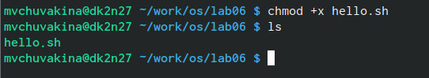{#fig:005 width=70%}

## Выполнение лабораторной работы

Снова открываю этот файл с помощью текстового редактора vi.

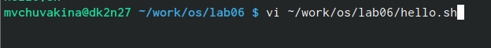{#fig:006 width=70%}

## Выполнение лабораторной работы

Изменяю местоположение курсора.

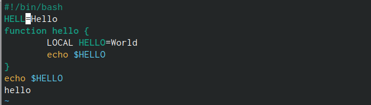{#fig:007 width=70%}

## Выполнение лабораторной работы

В режиме добавления (клавиша i) удаляю слово LOCAL, снова перехожу в командный режим с помощью esc.

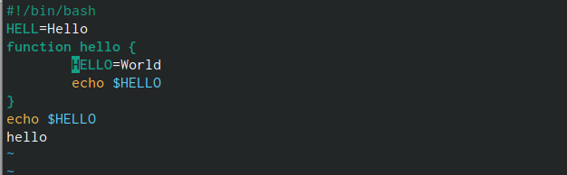{#fig:008 width=70%}

## Выполнение лабораторной работы

В режиме добавления (клавиша i) добавляю слово local, снова перехожу в командный режим с помощью esc.

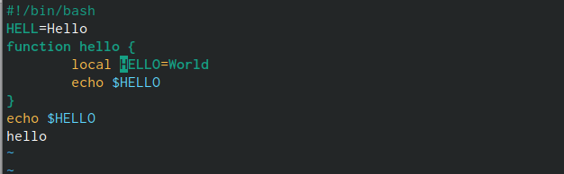{#fig:009 width=70%}

## Выполнение лабораторной работы

В режиме добавления (клавиша i) перехожу в конец последней строки и добавляю новую строку, снова перехожу в командный режим с помощью esc. После этого я вернулась в режим добавления, удалила строку и вернулась в командный режим.

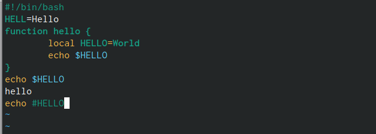{#fig:010 width=70%}

## Выполнение лабораторной работы

В командном режиме я нажала "u" и отменила последнее действие, удаление строки.

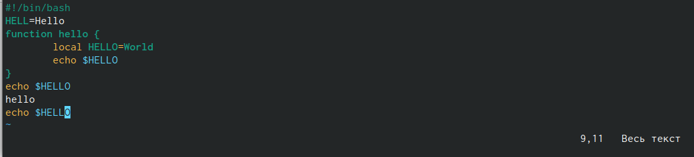{#fig:011 width=70%}

## Выполнение лабораторной работы

Перешла в режим последней строки и ввела w для сохранения файла и q для выхода, нажала enter и файл закрылся.

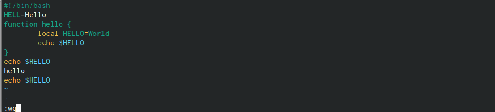{#fig:012 width=70%}

## Выводы

При выполнении данной лабораторной работы я познакомилась с операционной системой Linux, получила практические навыки работы с редактором vi, установленным по умолчанию практически во всех дистрибутивах.

