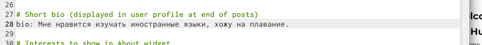
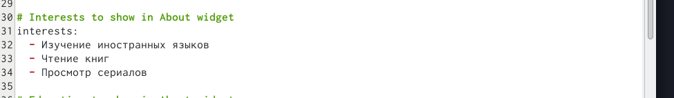
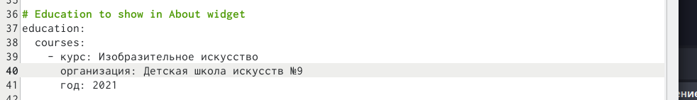
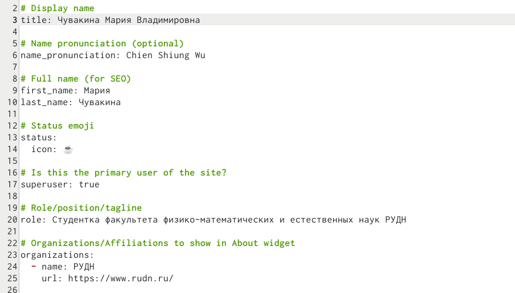
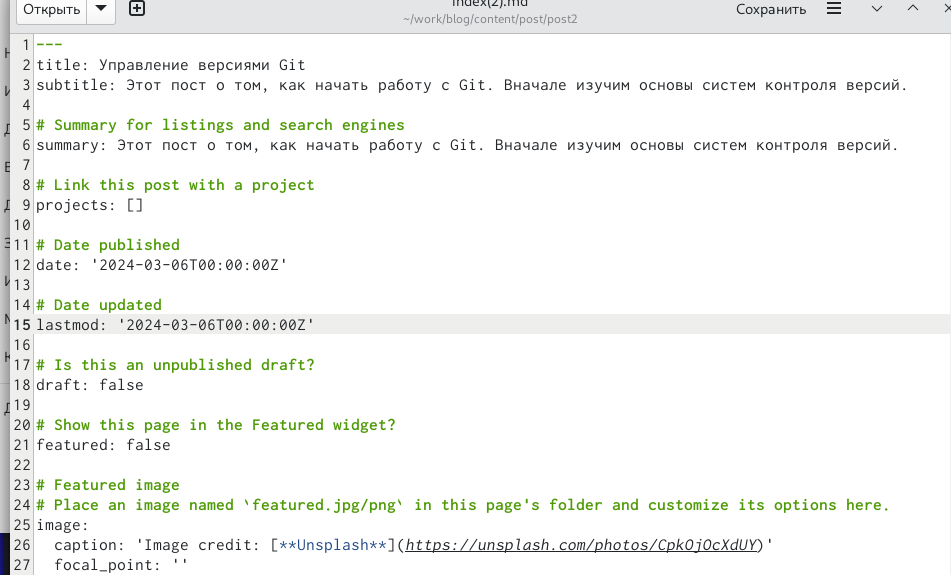
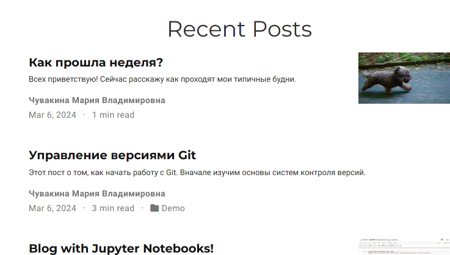
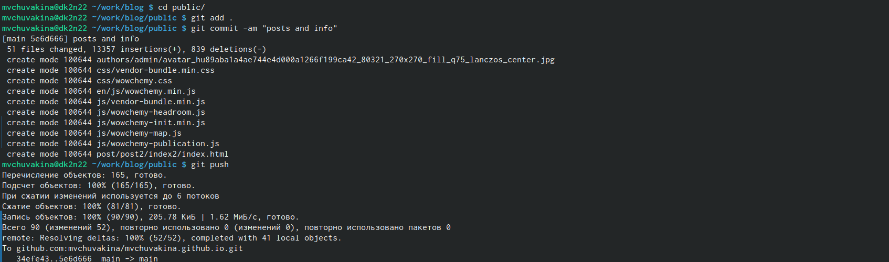

---
## Front matter
title: "Отчет по второму этапу индивидуального проекта"
subtitle: "Операционные системы"
author: "Чувакина Мария Владимировна"

## Generic otions
lang: ru-RU
toc-title: "Содержание"

## Bibliography
bibliography: bib/cite.bib
csl: pandoc/csl/gost-r-7-0-5-2008-numeric.csl

## Pdf output format
toc: true # Table of contents
toc-depth: 2
lof: true # List of figures
lot: true # List of tables
fontsize: 12pt
linestretch: 1.5
papersize: a4
documentclass: scrreprt
## I18n polyglossia
polyglossia-lang:
  name: russian
  options:
	- spelling=modern
	- babelshorthands=true
polyglossia-otherlangs:
  name: english
## I18n babel
babel-lang: russian
babel-otherlangs: english
## Fonts
mainfont: PT Serif
romanfont: PT Serif
sansfont: PT Sans
monofont: PT Mono
mainfontoptions: Ligatures=TeX
romanfontoptions: Ligatures=TeX
sansfontoptions: Ligatures=TeX,Scale=MatchLowercase
monofontoptions: Scale=MatchLowercase,Scale=0.9
## Biblatex
biblatex: true
biblio-style: "gost-numeric"
biblatexoptions:
  - parentracker=true
  - backend=biber
  - hyperref=auto
  - language=auto
  - autolang=other*
  - citestyle=gost-numeric
## Pandoc-crossref LaTeX customization
figureTitle: "Рис."
tableTitle: "Таблица"
listingTitle: "Листинг"
lofTitle: "Список иллюстраций"
lotTitle: "Список таблиц"
lolTitle: "Листинги"
## Misc options
indent: true
header-includes:
  - \usepackage{indentfirst}
  - \usepackage{float} # keep figures where there are in the text
  - \floatplacement{figure}{H} # keep figures where there are in the text
---

# Цель работы

Продолжить работы со своим сайтом. Редактировать его в соответствии с требованиями. Добавить данные о себе.

# Задание

1. Разместить фотографию владельца сайта.
2. Разместить краткое описание владельца сайта (Biography).
3. Добавить информацию об интересах (Interests).
4. Добавить информацию от образовании (Education).
5. Сделать пост по прошедшей неделе.
6. Добавить пост на тему управление версиями. Git.

# Теоретическое введение

Hugo - генератор статических страниц для интернета.
**Статические сайты:**
1. Статические сайты состоят из уже готовых HTML-страниц.
2. Эти страницы собираются заранее, а не готовятся для пользователя «на лету». Для этого используют генераторы статичных сайтов.
3. Так как это почти чистый HTML, то такие сайты быстрее загружаются и их проще переносить с сервера на сервер.
4. Минус: если нужно что-то обновить на странице, то сначала это правят в исходном файле, а потом запускают обновление в генераторе.
5. Ещё минус: такие страницы не подходят для интернет-магазинов или сайтов с личным кабинетом, потому что в статике нельзя сформировать страницу для каждого отдельного пользователя.

# Выполнение лабораторной работы

Добавила свою фотографию в папку blog/content/authors/admin, удалила фотографию шаблона (рис.1).

{#fig:001 width=70%}

В файле index.md в той же папке изменяю поля. Начинаю с библиографии (рис.2).

{#fig:002 width=70%}

Изменила интересы (рис.3).

{#fig:003 width=70%}

Добавила свое образование (рис.4).

{#fig:004 width=70%}

Обновила личные данные, чтобы они были про меня (рис.5).

{#fig:005 width=70%}

Проверила, что на локальном сайте все есть. Локальный сайт запускается с помощью hugo server (рис. 6).

{#fig:006 width=70%}

Создаю папки в директории post, которые обозначают посты и в которых будут тексты постов, картинки и доп. файлы (рис.7).

{#fig:007 width=70%}

Заполнила файл index.md в getting-started, это пост про прошедшую неделю (рис.8).

{#fig:008 width=70%}

Заполнила файл index.md в post2, это пост про управление версиями Git (рис.9).

{#fig:009 width=70%}

Проверяю посты на локальном сервере (рис.10).

{#fig:010 width=70%}

Закрываю локальный сервер. Генерирую сайт с изменениями (рис.11).

{#fig:011 width=70%}

Сохраняю изменения на гите (рис.12).

{#fig:012 width=70%}

Сохраняю изменения в папке, изменения в которой отправятся на репозиторий, где лежит сайт (рис.13).

{#fig:013 width=70%}

Проверила, как выглядит сайт в браузере (рис.14).

{#fig:014 width=70%}

# Выводы

В процессе выполнения второго этапа индивидуального проекта я научилась редактировать данные о себе, а также писать посты и добавлять их на сайт.

