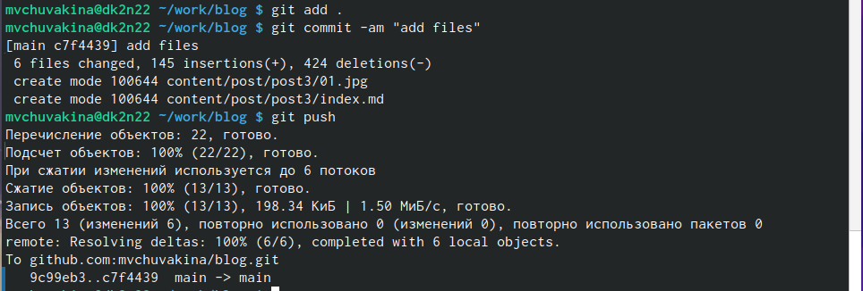

---
## Front matter
lang: ru-RU
title: Третий этап индивидуального проекта
subtitle: Операционные системы
author:
  - Чувакина М. В.
institute:
  - Российский университет дружбы народов, Москва, Россия
date: 21 марта 2024

## i18n babel
babel-lang: russian
babel-otherlangs: english

## Formatting pdf
toc: false
toc-title: Содержание
slide_level: 2
aspectratio: 169
section-titles: true
theme: metropolis
header-includes:
 - \metroset{progressbar=frametitle,sectionpage=progressbar,numbering=fraction}
 - '\makeatletter'
 - '\beamer@ignorenonframefalse'
 - '\makeatother'
---

# Информация

## Докладчик

:::::::::::::: {.columns align=center}
::: {.column width="70%"}

  * Чувакина Мария Владимировна
  * студентка из группы НКАбд-06-23
  * факультет физико-математических и естественных наук
  * Российский университет дружбы народов
  * [1132236055@rudn.ru](mailto:1132236055@rudn.ru)
  * <https://mvchuvakina.github.io/ru/>

:::
::: {.column width="30%"}

:::
::::::::::::::

## Цель работы

Продолжить работы со своим сайтом. Редактировать его в соответствии с требованиями. Добавить данные о своих достижениях.

## Задание

1. Добавить информацию о навыках (Skills).
2. Добавить информацию об опыте (Experience).
3. Добавить информацию о достижениях (Accomplishments).
4. Сделать пост по прошедшей неделе.
5. Добавить пост на тему по выбору.

## Выполнение проекта

Захожу в терминал, перехожу в директорию ~/work/blog, ввожу команду ~/bin/hugo server для запуска локального сервера.

## Выполнение проекта

Перехожу в директорию ~/work/blog/content, открываю файл _index.md, в нем будет осуществляться дальнейшая работа.

## Выполнение проекта

В блоке features, там, где заголовок Skills прописала навыки. Иконки для навыков искала, найдя в интернете официальную библиотеку иконок fas, так можно найти и иконки из библиотеки fab.

## Выполнение проекта

Далее добавила свой опыт в блоке Experience, добавила даты и нужную информацию.

## Выполнение проекта

Далее в Accomplishments добавила достижения.

## Выполнение проекта

Добавила пост на тему по выбору (язык разметки Markdown) в папке posts.

## Выполнение проекта

Добавила пост по прошедшей неделе в папке posts.

## Выполнение проекта

Закрываю локальный сервер с помощью клавиш Ctrl+C и собираю сайт с изменениями, введя команду ~/bin/hugo без аргументов.

## Выполнение проекта

Отправляю изменения на GitHub.

## Выполнение проекта

Теперь перехожу в директорию blog/public и отправляю изменения на GitHub, чтобы глобальный сайт тоже был обновлен.

## Выполнение проекта

Проверяю, что все сделано корректно.

## Выводы

В процессе выполнения третьего этапа индивидуального проекта я научилась редактировать данные о себе, а также писать посты и добавлять их на сайт.
