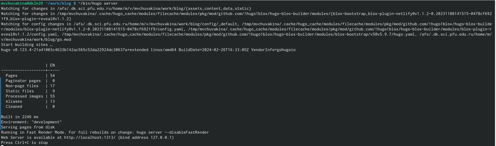
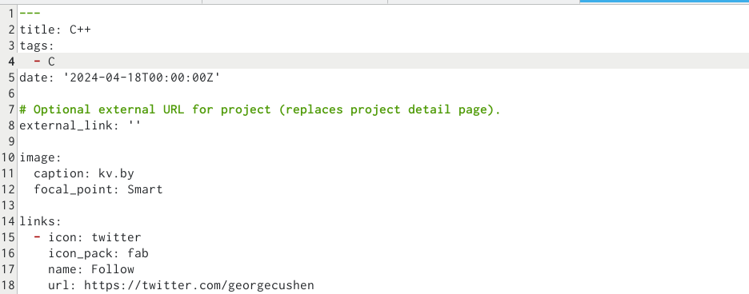
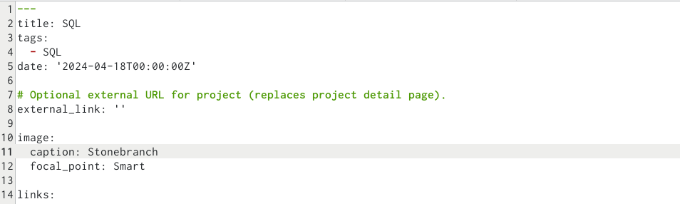
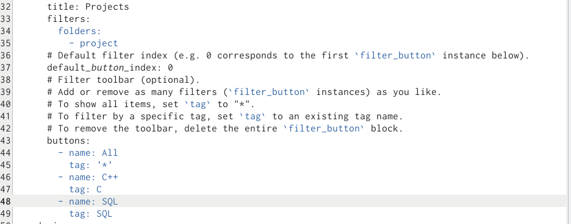
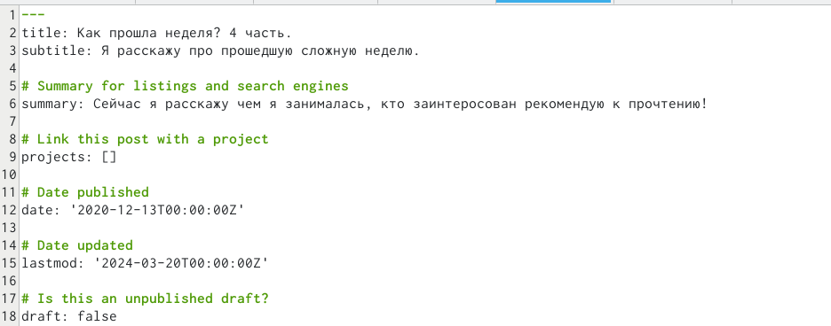
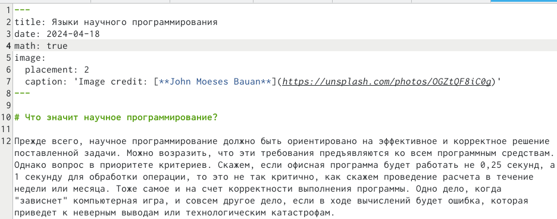
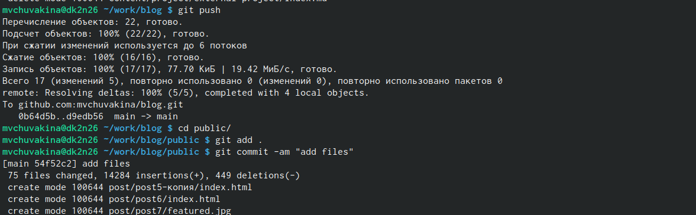
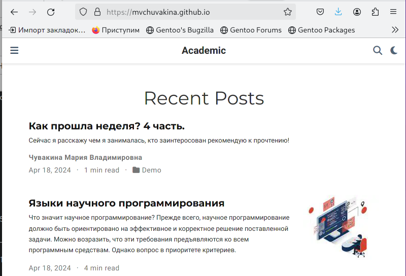

---
## Front matter
lang: ru-RU
title: 5 этап индивидуального проекта
subtitle: Операционные системы
author:
  - Чувакина М. В.
institute:
  - Российский университет дружбы народов, Москва, Россия
date: 18 апреля 2024

## i18n babel
babel-lang: russian
babel-otherlangs: english

## Formatting pdf
toc: false
toc-title: Содержание
slide_level: 2
aspectratio: 169
section-titles: true
theme: metropolis
header-includes:
 - \metroset{progressbar=frametitle,sectionpage=progressbar,numbering=fraction}
 - '\makeatletter'
 - '\beamer@ignorenonframefalse'
 - '\makeatother'
---

# Информация

## Докладчик

:::::::::::::: {.columns align=center}
::: {.column width="70%"}

  * Чувакина Мария Владимировна
  * студентка из группы НКАбд-06-23
  * факультет физико-математических и естественных наук
  * Российский университет дружбы народов
  * [1132236055@rudn.ru](mailto:1132236055@rudn.ru)
  * <https://mvchuvakina.github.io/ru/>

:::
::: {.column width="30%"}

:::
::::::::::::::

## Цель работы

Продолжить работы со своим сайтом. Редактировать его в соответствии с требованиями. Добавить данные о персональных проектах.

## Задание

- Сделать записи для персональных проектов.
- Сделать пост по прошедшей неделе.
- Добавить пост на тему по выбору:
        (Языки научного программирования)

## Теоретическое введение

Hugo — генератор статических страниц для интернета.

**Коротко: что такое статические сайты**
    1. Статические сайты состоят из уже готовых HTML-страниц.
    2. Эти страницы собираются заранее, а не готовятся для пользователя «на лету». Для этого используют генераторы статичных сайтов.
    3. Так как это почти чистый HTML, то такие сайты быстрее загружаются и их проще переносить с сервера на сервер.
    4. Минус: если нужно что-то обновить на странице, то сначала это правят в исходном файле, а потом запускают обновление в генераторе.
    5. Ещё минус: такие страницы не подходят для интернет-магазинов или сайтов с личным кабинетом, потому что в статике нельзя сформировать страницу для каждого отдельного пользователя.

## Выполнение лабораторной работы

Захожу в терминал, перехожу в директорию ~/work/blog, ввожу команду ~/bin/hugo server для запуска локального сервера. 

{#fig:001 width=70%}

## Выполнение лабораторной работы

Перехожу в директорию ~/work/blog/content/project, создаю файл C++, в нем будет осуществляться дальнейшая работа, далее добавляю нужную информацию о проекте. 

{#fig:002 width=70%} 

## Выполнение лабораторной работы

Затем создаю файл SQL и также добавляю нужную информацию о проекте. 

{#fig:003 width=70%}

## Выполнение лабораторной работы

Перехожу в директорию ~/work/blog/content/index.md и редактирую информацию о проектах, изменяю названия и теги. 

{#fig:004 width=70%}

## Выполнение лабораторной работы

Добавила пост по прошедшей неделе в папке posts. 

{#fig:005 width=70%}

## Выполнение лабораторной работы

Добавила пост на тему по выбору (языки научного программирования) в папке posts.

{#fig:006 width=70%}

## Выполнение лабораторной работы

Закрываю локальный сервер с помощью клавиш Ctrl+C и собираю сайт с изменениями, введя команду ~/bin/hugo без аргументов. Отправляю изменения на GitHub. Перехожу в директорию blog/public и отправляю изменения на GitHub, чтобы глобальный сайт тоже был обновлен.

{#fig:007 width=70%}

## Выполнение лабораторной работы

Проверяю, что все сделано корректно.

{#fig:008 width=70%}

## Выводы

В процессе выполнения пятого этапа индивидуального проекта я научилась редактировать данные о персональных проектах, а также писать посты и добавлять их на сайт.

